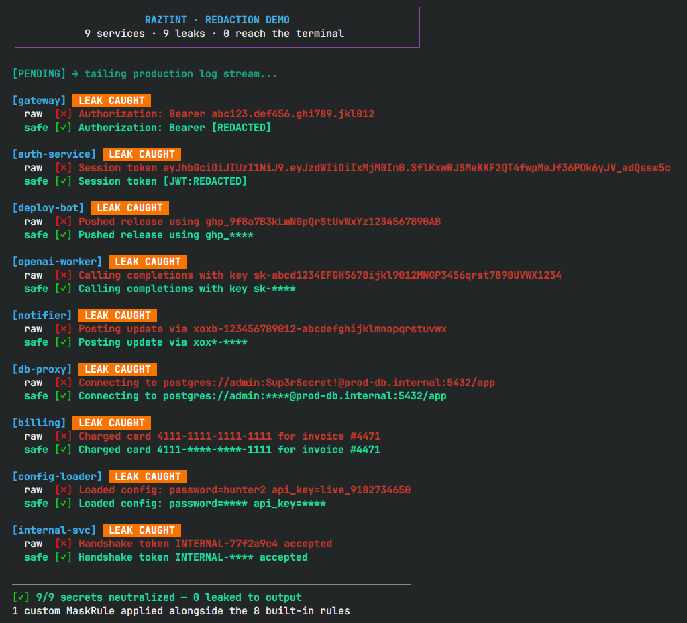

<div align="center">
  
  <br><br>

  [](https://pypi.org/project/raztint/)
  [](https://github.com/razbuild/raztint)
  [](https://codecov.io/gh/razbuild/raztint)

  [](https://pypi.org/project/raztint/)
  [](https://pepy.tech/project/raztint)
</div>

Every module in a CLI codebase ends up inventing its own way to print "success" or "error." One file uses green text, another uses an emoji, a third does both differently. Output looks inconsistent, breaks in CI, and nobody notices until a log line leaks a password.

```python
# before
print("\033[32mSuccess\033[0m")

# after
print(paint("Success", intent="success"))
```

RazTint defines a fixed mapping from intent (`success`, `danger`, `warning`, …) to color and icon once, and every call site reuses that same mapping instead of picking its own.

## Preview

<p align="center">
  
</p>
<p align="center"><em>A simulated production log stream — 9 secrets detected, 9 secrets redacted, 0 leaked to the terminal.</em></p>

## Table of Contents

- [When to Use RazTint](#when-to-use-raztint)
- [Installation](#installation)
- [Quick Start](#quick-start)
- [How It Compares](#how-it-compares)
- [Features](#features)
- [Logging Integration Example](#logging-integration-example)
- [Documentation](#documentation)
- [Known Limitations](#known-limitations)
- [Contributing](#contributing)
- [License](#license)

## When to Use RazTint

Reach for it if your CLI prints more than a couple of message types and you want them to look the same across modules, or you need output that renders correctly in CI, on Windows, and on terminals without a Nerd Font.

For a single colored `print()` in a one-off script, plain ANSI codes or `termcolor` are simpler and enough.

## Installation

Requires Python 3.10+.

```bash
pip install raztint
```

From source:

```bash
git clone https://github.com/razbuild/raztint.git
cd raztint
uv sync
```

## Quick Start

```python
from raztint import ok, paint

print(f"{ok()} File saved.")
print(paint("Connection failed.", color="red", icon="err"))

# intent sets color + icon together from one semantic name
print(paint("Deployment complete.", intent="success"))

# redact masks secrets before the string is printed
print(paint("password=1234", intent="debug", redact=True))  # password=****
```

Redaction on its own, without formatting:

```python
from raztint import redact

print(redact("password=supersecret api_key=ghp_abc123"))
# password=**** api_key=****
```

More examples in [Getting Started](docs/getting-started.md).

## How It Compares

| Capability                | colorama / termcolor | rich          | RazTint |
| :------------------------ | :-------------------: | :-----------: | :-----: |
| ANSI color support        | ✅                     | ✅             | ✅      |
| Terminal UI components    | ❌                     | ✅             | ❌      |
| Semantic logging intents  | ❌                     | ❌             | ✅      |
| Automatic icon fallback   | ❌                     | ⚠️ Partial     | ✅      |
| Secret masking            | ❌                     | ❌             | ✅      |
| Extra dependencies        | None                   | Several        | None    |

RazTint isn't a `rich` replacement for dashboards or tables, it solves the narrower problem of making `ok`/`err`/`warn`/`info` messages consistent and safe by default.

## Features

- **Intents**: presets (`success`, `danger`, `warning`, `debug`, …) that separate meaning from styling
- **`paint()`**: one call for color, background, styles, and icons
- **Status icons**: `ok()`, `err()`, `warn()`, `info()`, each with the three-tier fallback
- **Redaction**: pattern-based masking (`key=value` pairs like `password=`, `api_key=`, `token=`) applied as part of the formatting call, not a separate logging step; patterns are configurable, see [Security & Redaction](docs/redaction.md)
- **Environment detection**: Nerd Font → Unicode → ASCII, cached; configurable via `NO_COLOR`, `RAZTINT_FORCE_COLOR`
- **Typed**: `py.typed`, full public API type hints
- **Low-level escape hatch**: raw 16-color, 256-color, and 24-bit True Color support, plus bold/dim/italic/underline/strikethrough, for when intents aren't enough

## Logging Integration Example

RazTint only returns a formatted string, it doesn't hook into `logging` or replace a handler. Pass that string to `print()`, a logger, or anything else that accepts a string.

```python
import logging
from logging import Logger, getLogger

from raztint import paint

logging.basicConfig(level=logging.INFO, format="%(levelname)s: %(message)s")
logger: Logger = getLogger(__name__)

logger.info(paint("Database migration completed.", intent="success", icon=None))
logger.warning(paint("Disk usage above 90%.", intent="warning", icon=None, styles="dim"))
logger.error(
    paint("Authentication failed for token=abc123", intent="danger", redact=True, icon=None)
)
```

## Documentation

| Guide                                             | Description                                              |
| -------------------------------------------------- | --------------------------------------------------------- |
| [Getting Started](docs/getting-started.md)         | Functional usage, `paint()`, and the `tint` instance       |
| [API Reference](docs/api-reference.md)             | Colors, styles, icons, and `RazTint` class methods         |
| [Intents](docs/intents.md)                         | Semantic presets for common CLI messages                   |
| [Security & Redaction](docs/redaction.md)          | Masking tokens, credentials, and custom rules               |
| [Icons & Detection](docs/icons-and-detection.md)   | Icon modes and environment/font/color detection logic       |
| [Configuration](docs/configuration.md)             | Environment variables and runtime toggles                   |
| [Development](docs/development.md)                 | Local setup, tests, and linting                             |
| [Tutorial](docs/tutorial.md)                       | Philosophy, detection walk-through, and best practices      |

### Example Scripts

| Script                                             | Description                                  |
| --------------------------------------------------- | ---------------------------------------------- |
| [`examples/basic_usage.py`](examples/basic_usage.py) | Colors, styles, icons, intents, and redaction in one script |
| [`examples/paint_demo.py`](examples/paint_demo.py)   | Every color, style, and icon mode              |
| [`examples/real_world_cli.py`](examples/real_world_cli.py) | Simulated file-processor CLI            |

## Known Limitations

- Python 3.10+ only.
- Font detection relies on OS tools (`fc-list` on Linux, `system_profiler` on macOS, PowerShell on Windows). Set `RAZTINT_SKIP_SYSTEM_FONT_SCAN=1` in sandboxed environments.
- When `NO_COLOR` is set, all color output is suppressed regardless of other settings.

## Contributing

PRs and issues are welcome. Open an issue first to discuss before starting work on a feature.
See [CONTRIBUTING.md](https://github.com/razbuild/.github/blob/main/CONTRIBUTING.md) for setup and guidelines.

## License

[](https://github.com/razbuild/raztint/blob/master/LICENSE)

<div align="center">
  
</div>